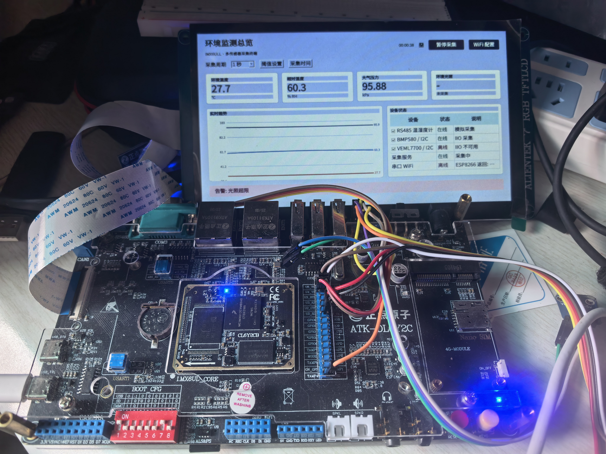
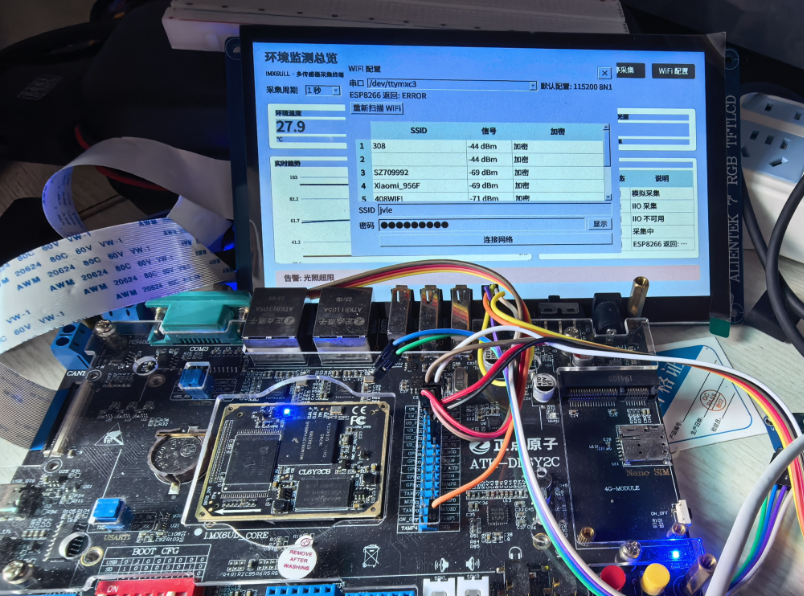
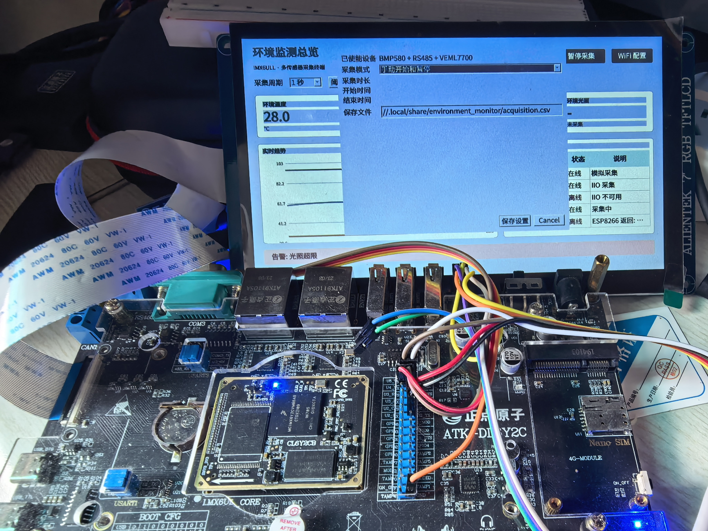
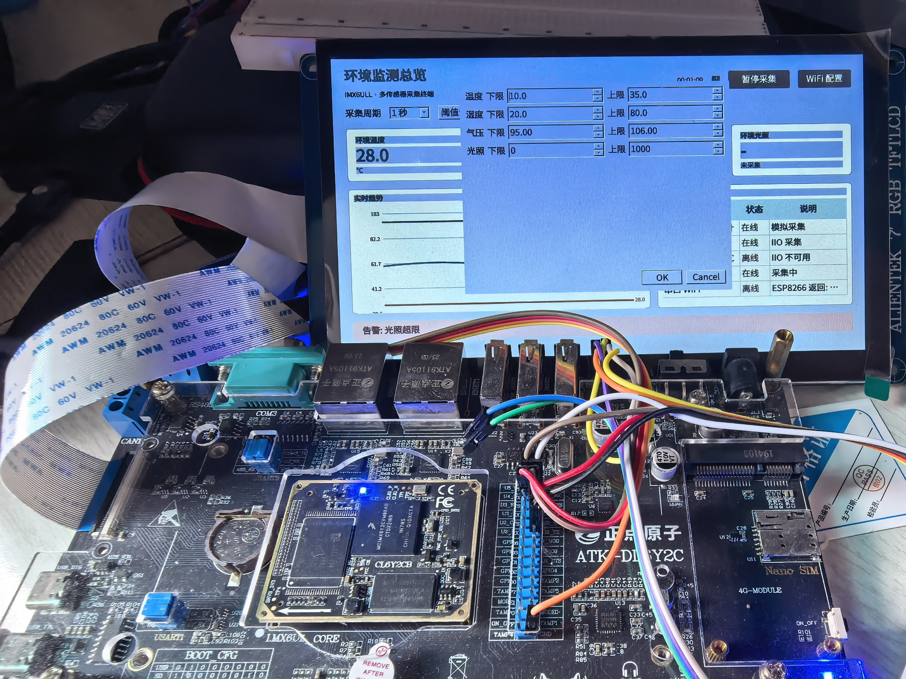
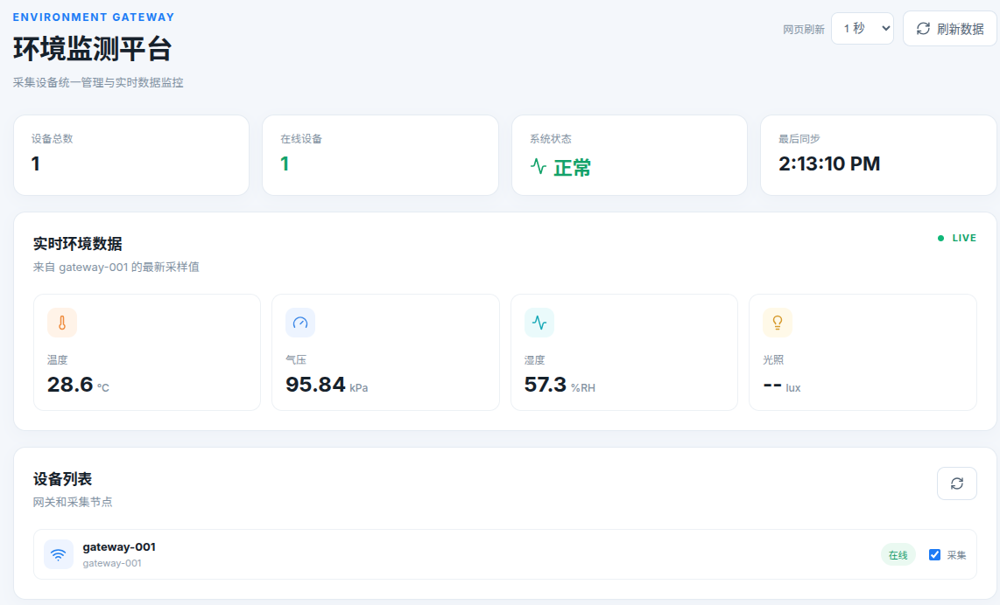
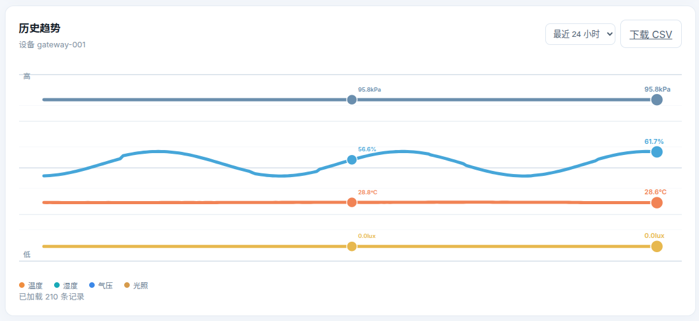
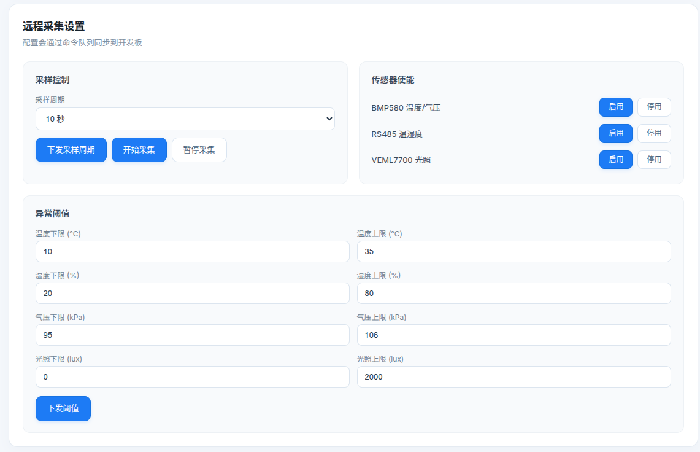
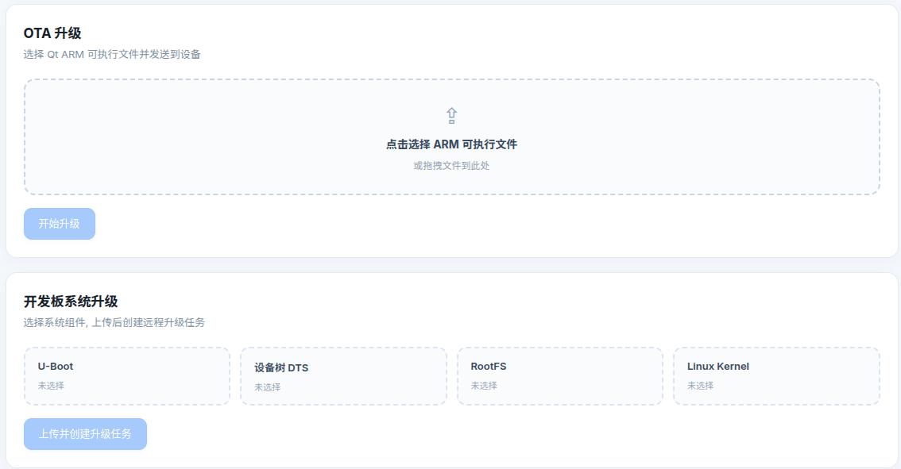

# IMX6ULL Environment Monitor

基于 IMX6ULL ARM 开发板 + Qt Widgets 的多传感器环境监测系统, 包含桌面端 Qt 应用、Rust Web 网关和 React 前端面板三部分.

## Qt 桌面应用

数据显示界面



WIFI 配置界面



采集模式调整界面



阈值设置界面



### 传感器驱动

- **BMP580** — SPI → 内核 IIO 驱动, 读取 `/sys/bus/iio/devices/iio:deviceX/in_temp_input` 和 `in_pressure_input`.
- **VEML7700** — I2C → 内核 IIO 驱动, 读取 `in_illuminance_input`, 按 `name` 文件自动发现设备节点. 支持 `ENVIRONMENT_MONITOR_VEML7700_SYSFS` 环境变量覆盖 sysfs 路径
- **RS485 温湿度计** — UART (Modbus RTU)
- **ESP8266 WiFi** — UART AT 指令透传 (`AT+CWMODE`, `AT+CWLAP`, `AT+CWJAP`, `AT+CIFSR`), 实现 WiFi 扫描、连接、HTTP 客户端

### 采集与告警

采集周期 1/5/10/30/60s, `QSettings` 持久化到 `/etc/environment_monitor/settings.ini`. 三种模式:

1. **手动** — 开始/暂停按钮控制
2. **定时长** — 指定秒数自动停止
3. **定时段** — 选起止时间, 定时触发

### ESP8266 WiFi 控制器

`Esp8266Controller` 封装完整的 AT 指令状态机:

- 串口非阻塞 I/O (`QSocketNotifier` + `QTimer`)
- AT 响应行解析 + IPD 数据包处理
- HTTP 客户端 (GET/POST), Content-Length 解析
- OTA 下载进度回调
- 命令队列轮询 (`pollRemoteCommand`), 从网关拉取 `set_sampling_interval` / `set_thresholds` / `set_device_enabled` / `start_collection` / `pause_collection` / `ota` / `system_update` 指令

### OTA 更新

两套 OTA 流程:

- **应用 OTA**: HTTP GET 下载 ARM 二进制 → SHA256 校验 → `scripts/environment_monitor_ota_apply.sh` 替换
- **系统 OTA**: 支持 uboot / kernel / dts / rootfs 四个分区独立上传, 网关聚合 manifest, 设备逐个下载写入 `/mnt/boot/update`

> 系统级 OTA 还有待完善, 思路为在 uboot 当中增加一个 boot_mode 参数, 升级过程中将新的 kernel, dts, rootfs 压缩到 /mnt/boot/update 目录, 在 recovery mode 下进入一个简洁的 kernel 环境, 并将更新的文件替换 normal mode 的环境, 之后重启进入 normal 环境.

## Web 网关

Axum 框架.

### API 端点

| 方法 | 路径 | 功能 |
| --- | --- | --- |
| GET | `/api/v1/devices` | 设备列表 (含在线状态和最新读数) |
| POST | `/api/v1/telemetry` | 接收设备遥测上报 |
| GET | `/api/v1/devices/{id}/telemetry` | 历史遥测 (JSON) |
| GET | `/api/v1/devices/{id}/telemetry.csv` | 历史遥测 (CSV 导出) |
| POST | `/api/v1/devices/{id}/commands` | 下发远程命令 |
| GET | `/api/v1/devices/{id}/commands` | 设备轮询待执行命令 |
| POST | `/api/v1/ota/upload` | 上传固件文件 (512MB 限制) |
| GET | `/api/v1/ota/{id}` | 下载固件 |
| POST | `/api/v1/system-updates` | 创建系统升级任务 |

### 命令队列

`HashMap<String, Vec<Command>>` 内存队列, 设备按 `device_id` 轮询:

- `set_sampling_interval` — 修改采样周期
- `set_thresholds` — 更新阈值
- `set_device_enabled` — 单个传感器使能/禁用 (`bmp580` / `rs485` / `veml7700` / `all`)
- `start_collection` / `pause_collection` — 全局采集开关
- `ota` — 触发应用 OTA
- `system_update` — 触发系统镜像升级

命令状态追踪: `HashMap<Uuid, String>` 记录 `dispatched` / `completed`.

## 构建与部署

### Qt 桌面端

```bash
cmake -S . -B build && cmake --build build && ./build/environment_monitor
```

ARM 交叉编译:

```bash
cmake -S . -B build-arm -DCMAKE_TOOLCHAIN_FILE=.../qt-toolchain.cmake
cmake --build build-arm
```

拷贝到板上运行:

```sh
/usr/bin/environment_monitor &
```

> 可以配置开机自启

### Rust 网关

```bash
cd server
cargo build --release
./target/release/environment-monitor-server
```

### Web 前端

```bash
cd server/web
npm install && npm run build
```

数据显示模块



采集趋势模块



远程控制模块



OTA 升级模块



### OTA 更新

## 开发板接线

| 外设 | 接口 | 引脚 |
| --- | --- | --- |
| BMP580 | ECSPI3 | CS0, SCLK, MOSI, MISO |
| VEML7700 | I2C2 | SCL, SDA |
| RS485 | UART3 | TX, RX |
| ESP8266 | UART4 | TX, RX |

---

## 使用指南

### 主界面

启动后看到四个指标卡片 (温度/湿度/气压/光照), 下方左侧是实时趋势图, 右侧是设备状态表.

**趋势图**: 横轴时间, 纵轴自适应数据范围. 四条彩色曲线分别对应温度 (橙)、湿度 (蓝)、气压 (灰蓝)、光照 (黄). 每条线末端有实时读数.

**设备状态表**: 列出 BMP580, RS485, VEML7700 三个传感器, 显示在线/待机/离线状态. 勾选复选框启用对应传感器, 取消勾选则停用.

### 开始采集

1. 在设备状态表里勾选需要的传感器
2. 顶部选择采样周期 (1~60 秒)
3. 点 `暂停采集` 按钮开始 (按钮会切换文字)
4. 指标卡片实时更新, 趋势图每秒追加数据点

### 阈值告警

点 `阈值设置` 按钮, 为温度/湿度/气压/光照分别设置下限和上限. 当任一传感器读数超出范围时, 界面底部出现红色告警条. 阈值自动保存到配置文件.

### 定时采集

点 `采集时间` 按钮, 三种模式:

- **手动** — 点开始/暂停按钮控制
- **采集指定时长** — 设置秒数/分钟数, 到时自动停止, CSV 文件自动保存
- **指定起止时间** — 选开始和结束时间, 到时间自动开始, 结束自动停止

CSV 保存路径可自定义, 默认 `/tmp/environment_monitor/acquisition.csv`.

### WiFi 配置

1. ESP8266 模块通过 UART 连接开发板
2. 点 `WiFi 配置` 按钮打开对话框
3. 对话框自动扫描周围 WiFi 网络, 双击 SSID 输入密码连接
4. 连接成功后, 网页端可以通过网关远程控制开发板

### OTA 升级

**应用升级** (更新 Qt 程序):

1. 电脑上运行 `./scripts/start_ota_server.sh -v 0.2.0`
2. 开发板 WiFi 连接后在 `WiFi 配置` 对话框填入电脑 IP (端口 18080)
3. 点 `检查并升级应用`, 下载完成后自动替换

**系统升级** (通过网页):

1. 打开网页端, 在 `开发板系统升级` 区域选择 uboot/kernel/dts/rootfs 文件
2. 点击上传, 开发板自动下载并写入 `/mnt/boot/update`

### 网页端

启动 Rust 网关后, 浏览器打开 `http://<开发板IP>:8080`. 网页端功能:

- 实时仪表盘: 四个指标卡片 + 设备在线状态
- 历史趋势: SVG 趋势图, 支持 1 小时/6 小时/24 小时/7 天切换
- 远程采集设置: 采样周期, 传感器使能, 阈值配置 (命令异步下发到开发板)
- OTA 升级: 上传固件文件, 远程触发升级
- CSV 导出: 下载历史数据

网页端操作会通过 WiFi 下发到开发板, 无需直连设备. 命令状态在开发板状态栏显示反馈.

## 更多文档

|模块|文档|
|-|-|
|BMP580|[BMP580](./BMP580.md)|
|VEML7700|[VEML7700](./VEML7700.md)|
|RS485|TODO|
|ESP8266|[ESP8266](./ESP8266.md)|
|OTA|[OTA_GUIDE](./OTA_GUIDE.md)|